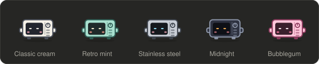

# nukey

A Claude Code mod: Nukey, a small microwave with a face in its window, sits above the prompt and acts out what Claude is doing, in the terminal and in the desktop app. When a turn is done it goes **DING!** Beside it, a control panel shows how full the context window is and how much of your rate limits is used.

> Optimised for the Claude Code desktop app.


## Install

```bash
claude plugin marketplace add arifamir/nukey-kit
claude plugin install nukey@nukey-kit
```

Requires Claude Code v2.1.287 or later; tested with v2.1.289.

To get new versions, run `claude plugin update nukey@nukey-kit`, or enable auto-update for the marketplace under `/plugin` → Marketplaces.

## Commands

| Command | What it does |
| :- | :- |
| `/nukey` | Hide or show Nukey |
| `/nukey demo` | Play every scene, three seconds each |
| `/nukey meter` | Hide or show the control-panel meter |
| `/nukey details` | Show or hide the meter's readings in figures beside the control panel |
| `/nukey commands` | Show commands as typed, or go back to the description of what they do |
| `/nukey theme` | Switch to the next colour theme |
| `/nukey theme <name>` | Switch to a theme by name: `classic`, `retro`, `steel`, `midnight` or `bubblegum` |

## Themes

Nukey comes in five finishes. The theme colours Nukey, its helpers and the control panel in the desktop app, and Nukey and the meter in the terminal. Your pick is remembered across sessions.



| Theme | Look |
| :- | :- |
| `classic` | Cream body, Claude-orange power bars (the default) |
| `retro` | 1950s mint green with warm eyes |
| `steel` | Stainless steel with ice-blue eyes |
| `midnight` | Dark body with amber eyes, for dark setups |
| `bubblegum` | Pink all over |

## Scenes

The scene follows the tool Claude calls. A shell command is read for what it does, so `cat` shows reading and `cd repo && git status` shows git.

| Scene | Shown when |
| :- | :- |
| thinking, writing a reply | Claude reasons or writes text |
| reading | `Read`, or `cat`, `head`, `tail`, `sed -n`, `jq` in a shell |
| writing code | `Edit`, `Write`, or `sed -i`, `cat > file` in a shell |
| searching | `Grep`, `Glob`, or `grep`, `rg`, `find`, `ls` in a shell |
| browsing the web | `WebFetch`, `WebSearch`, browser tools, `curl`, `wget` |
| running a command | any other shell command |
| running tests | `pytest`, `vitest`, `jest`, `npm test`, `cargo test` and the like |
| working with git | `git` and `gh`, also further on in a chain such as `make build && git status` |
| installing packages | `npm install`, `pip install`, `uv add`, `brew install` and the like |
| putting helpers to work | subagents and workflows, during the turn and while they run on after it; the line under it says how many are at work and what they are doing, such as `3 helpers: 2 reading, 1 running tests` |
| making a plan | plan mode and task lists |
| loading a skill | `Skill` |
| writing text | an edit to a text file: `.md`, `.txt`, `.rst`, `README`, `CHANGELOG` and the like |
| designing | an edit to a stylesheet or an `.svg`, a design or Figma tool, a design or diagramming skill, the start of an artifact, and an edit to an `.html` page later in that same turn |
| remembering something | an edit to `CLAUDE.md`, `MEMORY.md` or a memory file |
| sharing something | artifacts and files sent to you |
| a question for you, waiting for permission | Claude asks, or a permission dialog is open |
| waiting on a background task | Claude polls a background command or timer, or the turn ended with a command still running |
| using a tool | any other tool |
| tidying up its memory | the conversation is compacted |
| oops | a tool call failed, or an API error or refusal ended the turn |
| DING!, resting | the turn ended |

Work inside a subagent is not shown; Nukey stays on "putting helpers to work" until the helper returns.

## Meter

The control panel lights up as things are used:

- **Power bars**: the context window.
- **Five buttons**: the 5-hour rate limit.
- **Seven smaller buttons**: the weekly rate limit.

The last two units of a gauge turn red above 85%. The buttons are left out on accounts without rate-limit windows.

The meter comes in two forms, and `/nukey meter` hides it altogether:

| Default | With details (`/nukey details`) |
| :- | :- |
|  |  |

## Development

```bash
claude --plugin-dir ./plugins/nukey   # load from disk, reload on save
claude plugin test plugins/nukey      # run the tests
claude plugin validate plugins/nukey  # check the manifest and hooks
npx tsx plugins/nukey/scripts/make-demo.mts  # redraw the animations in assets/
```

The editor types under `.claude-plugin/types/` are generated and not committed. Claude Code writes them for your version when it loads the mod with `--plugin-dir`.

---

An unofficial community project, not affiliated with or endorsed by Anthropic.
